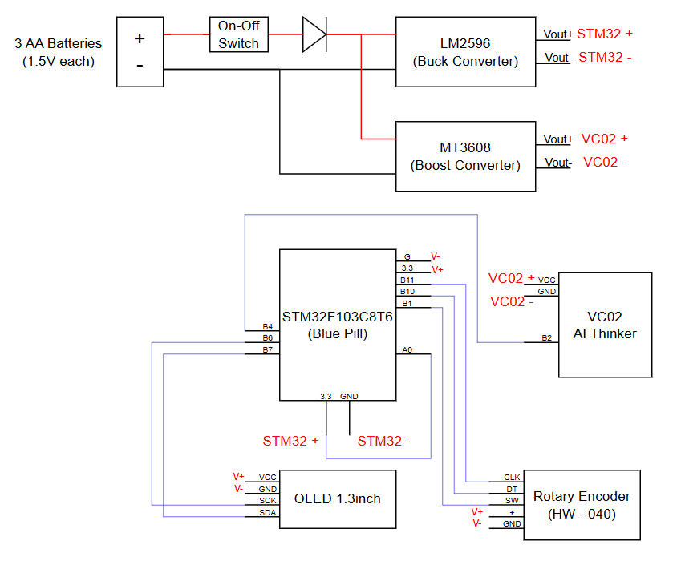

# Nam Mo Counter Project

In this project, I use the following components:

- **STM32F103C8T6**
- **VC02 AI Thinker**
- **3AA Battery Box**
- **Schottky Diode**
- **LM2596** – Used to supply the STM32; output voltage adjusted to ~3.3V
- **MT3608** – Used to supply the VC02 AI Thinker; output voltage adjusted to ~5V
- **OLED 1.3 inch display**
- **Rotary Encoder (HW-040)**

## Circuit Diagram

This is how the components are connected in the circuit:

## Assembly Instructions

1. Connect the components as shown in the circuit diagram.
2. Flash the program to the **STM32F103C8T6** – source code is located in the `Stm32_Source` folder.
3. Flash the firmware to the **VC02 AI Thinker** – see the [official documentation](https://docs.ai-thinker.com/en/voice_module) for detailed instructions. Firmware archive: `AI_Thinker.tar.gz`
4. 3D print the enclosure parts – files are stored in the `Solid` directory.

## Final Result

This is the final assembled product:

---

If you have any suggestions or feedback, feel free to contact me via  
Facebook: [https://www.facebook.com/nguyen.vdx/](https://www.facebook.com/nguyen.vdx/)  
Email: nguyen.voduongxuan@gmail.com